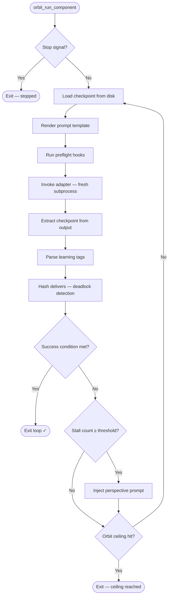
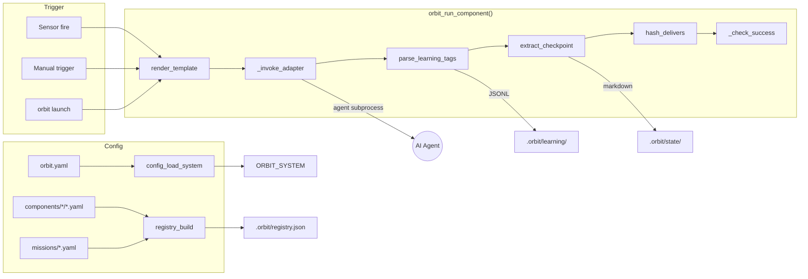
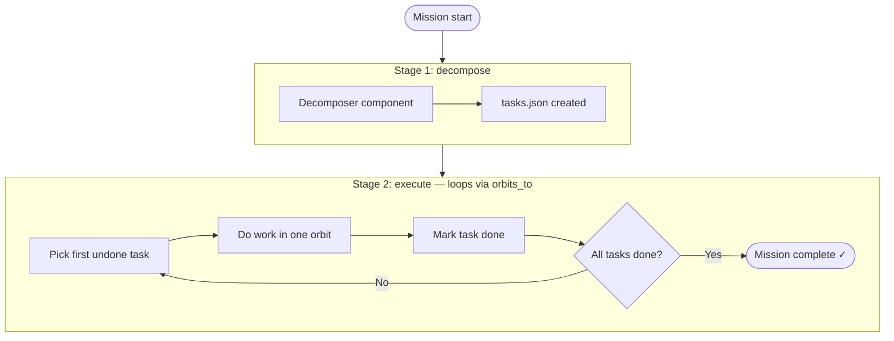
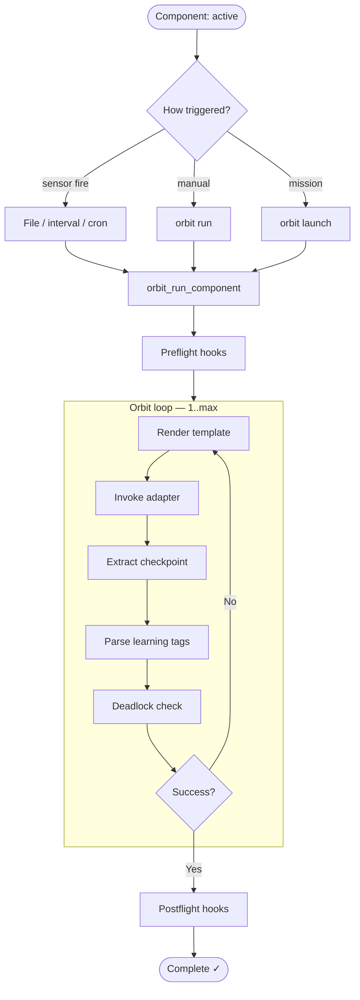
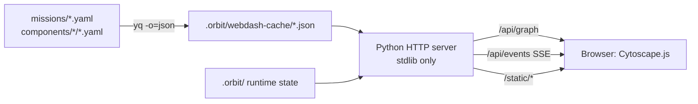

[← Back to Index](index.md)

# Architecture

## Design Principles

### Bash is the Runtime

Rover is a bash program. No Python runtime, no Node, no compiled binary. The
orbit loop is a `while` loop in bash. Dependencies are limited to bash 4+, jq,
yq (or python3 fallback), and cron for schedule sensors.

### Stateless Agents

Each agent invocation is a fresh subprocess. There are no persistent agent
processes, no session IDs, no conversation continuity between orbits. The agent
is stateless and ephemeral — it starts fresh every orbit.

### Disk is the Only Memory

State lives in `.orbit/`. Insights and decisions live in `.orbit/learning/`.
Feedback is co-located with components. Task state lives in `.orbit/plans/`.
Nothing of value lives in memory between invocations.
Checkpoints bridge orbits by persisting agent context to disk.

### Promise Flag Exit

The orbit loop runs until the success condition is satisfied. `orbits.max` is a
safety ceiling, not the intended exit mechanism. The agent's job is to produce
the deliverable that satisfies the exit condition.

### No Inflight Compaction

Rover has no context window monitoring, no compaction signals, no background
context size checks. Context exhaustion is prevented by task sizing at design
time (the decomposer pattern), not detected at runtime.

## The Ralph Loop

The Ralph loop is the core execution pattern:



## Data Flow



## Two-Tier Mission Pattern

Complex work uses a planning tier followed by an implementation tier:



The decomposer breaks work into atomic tasks stored in `.orbit/plans/`. The
worker processes one task per orbit, checking off completions. The `orbits_to`
mechanism loops the worker stage back to itself until all tasks are done.

## Component Lifecycle



## Dashboard Architecture

Rover provides two dashboard modes:

**TUI Dashboard** (`orbit dashboard`) — A terminal dashboard using gum for
styled output. Reads `.orbit/` state directly and renders missions, components,
sensors, and gates with progress bars and status icons.

**Web Dashboard** (`orbit dashboard --web`) — A Cytoscape.js topology
visualization served by a Python stdlib HTTP server. The bash entry point
pre-converts YAML configs to JSON using `yq`, then launches a Python server
that reads those JSON files plus `.orbit/` runtime state. No external Python
packages are required.



The web dashboard shares the same API contract as Orbit Station (Go), meaning
the same frontend code (HTML/CSS/JS) runs against both backends.

See [Dashboard](dashboard.md) for full details.

## Atomic Writes

All writes to JSONL files and state files are atomic. The pattern is:

1. Write content to a `.tmp` file in the same directory
2. `mv` the temp file to the target path
3. The rename is atomic on POSIX filesystems

This prevents partial writes from corrupting state, which is critical since
Rover may be interrupted at any point.

## ID Generation

IDs are generated without requiring `uuidgen`:

```bash
echo -n "${timestamp}${content}${RANDOM}" | sha256sum | head -c 12
```

Prefixed by type: `fb-` (feedback), `ins-` (insight), `dec-` (decision),
`req-` (tool request), `run-` (run).

## Exit Codes

| Code | Meaning |
|------|---------|
| 0 | Success — promise flag satisfied |
| 1 | Failure — ceiling reached, deadlock abort, or stage failure |
| 2 | Flight rule abort |
| 3 | Graceful stop — operator requested via `orbit stop` |

[← Back to Index](index.md)
