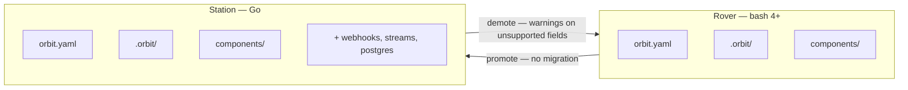

[← Back to Index](index.md)

# Compatibility

Orbit Rover is the open-source, zero-infrastructure tier of the Orbit platform.
The `.orbit/` directory format is designed to be interchangeable with Orbit
Station (the Go implementation), enabling promotion and demotion between tiers.

## Tier Overview

| Tier | Runtime | Infrastructure | Use Case |
|------|---------|---------------|----------|
| **Rover** | Bash 4+ | None | Solo developers, edge, privacy-first |
| **Station** | Go | Optional (Postgres, webhooks) | Teams, cloud deployment |

## Schema Contract

Rover and Station share the same YAML configuration schema and `.orbit/` state
directory format. The canonical schema is defined in the Station Go
implementation at `github.com/Modal-Vector/orbit`:

| Package | Schema |
|---------|--------|
| `internal/config/` | ComponentConfig, MissionConfig, SensorsConfig, Orbits, Retry, ToolsConfig |
| `internal/learning/store.go` | ScopeKind constants (project, mission, module, component, run, stage) |
| `internal/insight/` | Insight JSONL entry schema |
| `internal/decision/` | Decision JSONL entry schema |
| `internal/feedback/` | Feedback JSONL entry schema |
| `internal/manual/` | Gate prompt/response file format |



## Promotion: Rover to Station

A project built with Rover can be promoted to Station:

1. The `orbit.yaml` and all component/mission YAML files are valid for both
2. The `.orbit/` state directory is readable by Station
3. Learning data (JSONL) transfers without modification
4. Waypoints and run state are compatible

No data migration is needed — copy the project directory and run with Station.

## Demotion: Station to Rover

A Station project can be demoted to Rover with caveats:

1. Station-only features will produce warnings (not errors)
2. Unsupported fields are ignored at runtime
3. Postgres-backed state falls back to file-based storage
4. Webhooks must be replaced with file sensors
5. Container and C2 deployments are not supported

## Unsupported Station Fields

Rover warns and continues when it encounters these fields:

| Field | Category | Alternative in Rover |
|-------|----------|---------------------|
| `resource_pool` | Resource management | — |
| `inflight` | Concurrency control | — |
| `streams` / `streams.backend` | Event streaming | — |
| `webhooks` | HTTP triggers | File sensors |
| `serve` / `serve.enabled` / `serve.port` | HTTP server | — |
| `deployment: contained` | Container deployment | — |
| `deployment: c2` | C2 deployment | — |
| `state.backend: postgres` | Database state | File-based state |

Warning format:
```
[ROVER WARN] orbit.yaml: 'webhooks' not supported in Rover (Station feature). Use file sensors as an alternative.
```

## Dependencies

### Required

| Dependency | Version | Purpose |
|------------|---------|---------|
| bash | 4.0+ | Runtime |
| jq | any | JSON processing |

### YAML Parsing (one of)

| Dependency | Priority | Notes |
|------------|----------|-------|
| yq | Preferred | Faster, native YAML |
| python3 + PyYAML | Fallback | Broader availability |

### Agent Adapters (at least one)

| Adapter | Command | Purpose |
|---------|---------|---------|
| claude-code | `claude` | Claude Code CLI |
| opencode | `opencode` | OpenCode CLI |

### Optional

| Dependency | Purpose |
|------------|---------|
| inotifywait | Efficient file watching (vs polling) |
| cron | Schedule-based sensors |
| ollama | Local model inference |

## Security Considerations

- **Agent isolation:** Each orbit is a fresh subprocess with no inherited state
- **API keys:** Managed by the adapter CLI, not by Rover
- **Cron security:** Entries are tagged (`# orbit-rover:{name}`) for safe cleanup
- **Tool auth:** Deterministic keys validated before tool execution
- **Learning integrity:** Atomic writes prevent JSONL corruption
- **No network access:** Rover itself makes no network calls — adapters handle
  all external communication

[← Back to Index](index.md)
