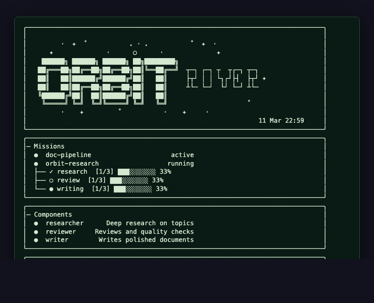
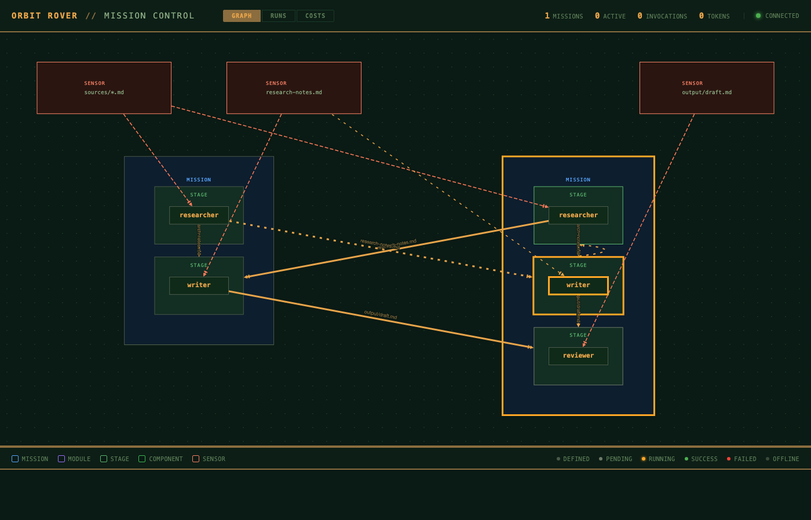

[← Back to Index](index.md)

# Dashboard

Orbit Rover includes two dashboard modes for monitoring your system: a terminal
TUI and a web-based topology visualization.

## TUI Dashboard

The default dashboard renders in the terminal using [gum](https://github.com/charmbracelet/gum)
for styled output, with a plain-text fallback when gum is not installed.

```bash
orbit dashboard
```



The TUI shows:

- **Banner** — ORBIT ROVER ASCII art with purple→cyan gradient
- **Missions panel** — Each mission with status, stage tree with progress bars
  and completion percentages
- **Components panel** — All registered components with descriptions
- **Metrics bar** — Active sensors, pending gates, pending tool requests

### TUI Options

| Option | Description |
|--------|-------------|
| `--refresh N` | Refresh interval in seconds (default: 2) |
| `--once` | Render once and exit (useful for CI/scripting) |
| `--no-color` | Disable gum styling, use plain text |

### TUI Keyboard Shortcuts

| Key | Action |
|-----|--------|
| `r` | Refresh immediately |
| `q` | Quit |

---

## Web Dashboard

The web dashboard provides a full topology visualization using Cytoscape.js with
the same PCB-inspired dark theme as Orbit Station.

```bash
orbit dashboard --web
```



### Prerequisites

- **python3** — Uses only stdlib modules (`http.server`, `json`, `os`, etc.). No
  pip packages required.
- **yq** — Already a Rover dependency. Used to convert YAML configs to JSON for
  the Python server.

### Web Options

| Option | Description |
|--------|-------------|
| `--web` | Launch web dashboard instead of TUI |
| `--port N` | HTTP port (default: 8067) |
| `--no-open` | Don't auto-open browser on start |

### How It Works

1. The bash entry point (`cmd/dashboard.sh`) converts all `missions/*.yaml` and
   `components/*/*.yaml` to JSON in `.orbit/webdash-cache/` using `yq`
2. A Python stdlib HTTP server starts, serving the API and static frontend
3. The server reads cached JSON configs + `.orbit/` runtime state
4. On each API call, the server checks if YAML source files changed (by mtime)
   and re-invokes `yq` only when needed
5. The browser receives graph data via SSE (Server-Sent Events) for live updates

```
orbit dashboard --web --port 8067
    │
    cmd/dashboard.sh
    │  ├── yq converts YAML → JSON in .orbit/webdash-cache/
    │  └── launches python3 lib/webdash/server.py
    │
    lib/webdash/
      server.py         ─── HTTP server + routing
      graph_builder.py   ─── Graph topology (port of Go graph.go)
      api_handlers.py    ─── API endpoints + YAML refresh
      learning_handlers.py ── Learning JSONL readers
      static/            ─── Frontend (from Station, vendored JS)
```

### Graph Topology

The web dashboard builds a directed graph showing the full system architecture:

**Node types:**
- **Mission** (blue border) — compound container holding stages
- **Stage** (green border) — compound container holding a component instance
- **Component** (dark green) — leaf node inside a stage, or standalone
- **Sensor** (orange border) — file watch patterns that trigger components/missions

**Edge types:**
- **depends_on** (solid green) — stage sequencing within a mission
- **orbits_to** (dashed copper) — feedback loops between stages
- **triggers** (dashed orange) — sensor → mission/component connections
- **delivers** (solid copper, labeled) — file delivery connections between components

**Status overlay:** Nodes reflect runtime status with LED-style indicators:
- Defined (dim), Pending (gray), Running (amber glow), Success (green),
  Failed (red glow), Offline (faded)

### Views

The web dashboard has three tab views:

**Graph** — The default topology visualization. Click nodes to open a detail
panel showing configuration, runtime status, stage progress, flight rules,
and run history.

**Runs** — Table of all mission runs with status dots, stage mini-dots, and
a filter input. Click a row to see run details.

**Costs** — Breakdown of token usage and costs by model, component, stage,
mission, and run. Includes cache read ratio calculation.

### Keyboard Shortcuts

| Key | Action |
|-----|--------|
| `r` / `f` | Reset graph view (fit to viewport) |
| `e` | Toggle event log |
| `h` | Toggle runs view |
| `c` | Toggle costs view |
| `i` | Close detail panel |
| `Escape` | Close detail panel |

### API Endpoints

The Python server exposes the same API contract as Orbit Station:

| Endpoint | Description |
|----------|-------------|
| `GET /api/graph` | Full topology (nodes, edges, metrics) |
| `GET /api/events` | SSE stream with hash-based dedup |
| `GET /api/missions` | Mission list |
| `GET /api/missions/{name}` | Mission detail (stages, flight rules) |
| `GET /api/components` | Component list |
| `GET /api/components/{name}` | Component detail |
| `GET /api/runs` | Run list (newest first) |
| `GET /api/runs/{id}` | Run detail |
| `GET /api/sensors` | Sensor list |
| `GET /api/flight-rules` | Flight rules by mission |
| `GET /api/telemetry` | Per-component telemetry |
| `GET /api/costs` | Cost breakdown |
| `GET /api/learning/summary` | Learning entry counts |
| `GET /api/learning/feedback` | Feedback entries |
| `GET /api/learning/insights` | Insight entries |
| `GET /api/learning/decisions` | Decision entries |
| `GET /api/modules` | Module list (name, stages, parameters, delivers) |

### Offline Operation

The web dashboard works fully offline — all JavaScript dependencies are vendored
in `lib/webdash/static/js/vendor/`:

- Cytoscape.js 3.28.1 — graph visualization
- dagre 0.8.5 — DAG layout algorithm
- cytoscape-dagre 2.5.0 — Cytoscape layout plugin
- cytoscape-node-html-label 1.2.2 — rich HTML node labels

Fonts use the system monospace stack (SF Mono, Fira Code, Cascadia Code,
JetBrains Mono, Consolas) with no CDN dependencies.

### Station Compatibility

The web dashboard serves the same frontend and API contract as Orbit Station
(Go). The `.orbit/` directory is interchangeable — you can start with Rover's
web dashboard and later switch to Station without changing the frontend.

[← Back to Index](index.md)
