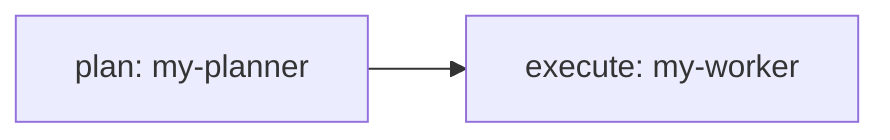

[← Back to Index](index.md)

# Getting Started

## Prerequisites

### Required

| Dependency | Minimum Version | Purpose |
|------------|----------------|---------|
| bash | 4.0+ | Runtime environment |
| jq | any | JSON processing |

### Recommended

| Dependency | Purpose |
|------------|---------|
| yq | YAML parsing (preferred over Python fallback) |
| python3 | YAML fallback parser (requires PyYAML) |
| cron | Schedule-based sensors |

### Agent Adapters (at least one)

| Adapter | Command | Purpose |
|---------|---------|---------|
| claude-code | `claude` | Claude Code CLI agent |
| opencode | `opencode` | OpenCode CLI agent |

### Optional

| Dependency | Purpose |
|------------|---------|
| inotifywait | Efficient file watching (falls back to polling) |
| ollama | Local model inference |

## Verify Dependencies

```bash
./orbit doctor
```

This checks all critical and optional dependencies and reports their status.

## Creating a Project

```bash
./orbit init my-project
cd my-project
```

This creates the full project scaffolding:

```
my-project/
├── orbit.yaml            # System configuration
├── CLAUDE.md             # Agent context (loaded by claude-code in session)
├── RISK-REGISTRY.md      # Risk tracking template
├── components/           # Component YAML definitions
├── missions/             # Mission YAML definitions
├── modules/              # Reusable module definitions
├── prompts/              # Prompt templates (Markdown)
├── scripts/              # Lifecycle hooks and helpers
├── tools/                # Tool scripts and index
│   └── _auth-check.sh   # Auth key validation helper
└── .orbit/               # Runtime state (gitignored)
    ├── state/            # Component checkpoints
    ├── runs/             # Mission run state
    ├── plans/            # Task decomposition plans
    ├── learning/         # Feedback, insights, decisions
    ├── sensors/          # Active sensor state
    ├── triggers/         # Trigger signal files
    ├── manual/           # Approval gate state
    ├── tool-auth/        # Tool authorisation grants
    ├── tool-requests/    # Pending tool requests
    ├── cascade/          # Cascade block tracking
    └── logs/             # Event JSONL logs
```

## Using AI Tools to Author Configs

The `docs/specs/` directory contains concise, annotated YAML schema references
designed to be used as context with any AI development tool. When asking Claude,
Cursor, Copilot, or any other AI assistant to help create Orbit configurations:

1. Paste the relevant spec doc as context (e.g. `docs/specs/component.md`)
2. Describe what you want the component/mission to do
3. The AI will produce valid YAML that matches the actual schema

Each spec doc includes the complete schema, minimal and real-world examples,
a field reference table, and common mistakes to avoid.

## Defining a Component

Create `components/my-worker.yaml`:

```yaml
name: my-worker
description: Processes tasks from the plan
prompt: prompts/my-worker.md

agent: claude-code
model: sonnet
timeout: 300
max_turns: 10

delivers:
  - output/result.md

orbits:
  max: 20
  success:
    when: file
    condition: output/result.md
  deadlock:
    threshold: 3
    action: perspective
```

Create the prompt template at `prompts/my-worker.md`:

```markdown
# My Worker — Orbit {orbit.n}/{orbit.max}

## Checkpoint
{orbit.checkpoint}

## Task
Process the input and produce output/result.md.

<checkpoint>
Write your progress notes here for the next orbit.
</checkpoint>
```

## Running a Component

```bash
# Run a single component directly
./orbit run my-worker

# Trigger a component via the sensor system
./orbit trigger my-worker
```

## Defining a Mission

Create `missions/my-mission.yaml`:

```yaml
name: my-mission
description: End-to-end pipeline

stages:
  - name: plan
    component: my-planner
  - name: execute
    component: my-worker
    depends_on:
      - plan
```



## Launching a Mission

```bash
# Execute the mission
./orbit launch my-mission

# Preview execution plan without running
./orbit launch my-mission --dry-run

# Resume a failed mission from last checkpoint
./orbit launch my-mission --resume
```

## Watch Mode

Start reactive sensor monitoring:

```bash
./orbit watch
```

This activates all configured sensors (file watch, interval, cron) and
dispatches components automatically when triggers fire.

## Monitoring with the Dashboard

Rover includes two dashboard modes for monitoring your system:

```bash
# Terminal TUI (requires gum for styled output)
./orbit dashboard

# Web dashboard with topology graph
./orbit dashboard --web
```

The web dashboard provides a Cytoscape.js topology visualization showing
missions, stages, components, sensors, and their connections with live status
updates. See [Dashboard](dashboard.md) for details.

## Next Steps

- [Dashboard](dashboard.md) — TUI and web dashboard
- [Configuration](configuration.md) — full YAML reference
- [CLI Reference](cli-reference.md) — all available commands
- [Studios](studios.md) — example projects to study

[← Back to Index](index.md)
