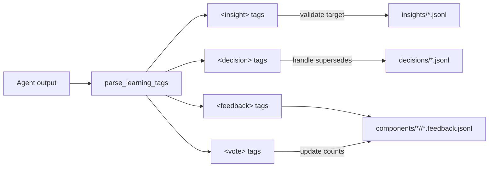
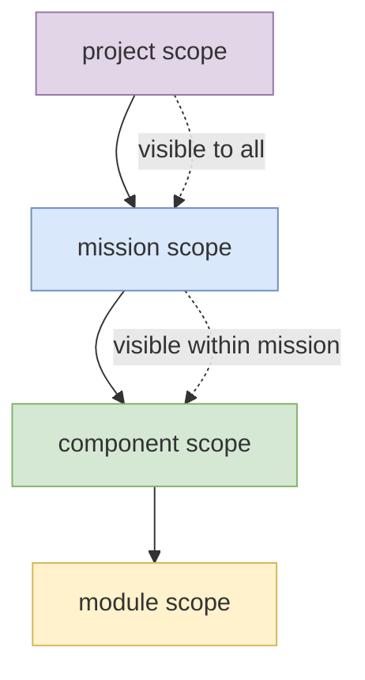
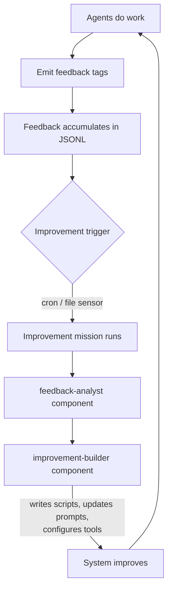
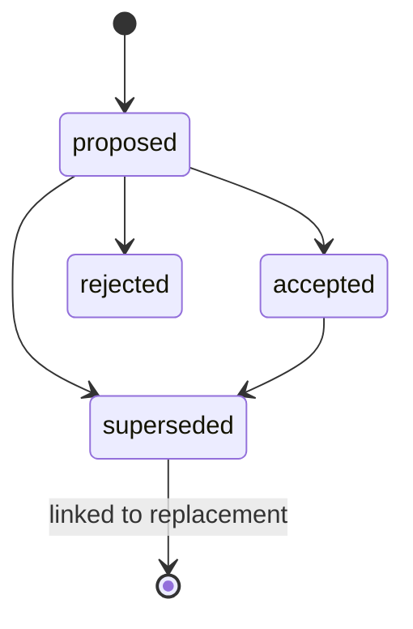

[← Back to Index](index.md)

# Learning System

The learning system captures knowledge generated by agents during orbit
execution. It stores feedback, insights, and decisions as JSONL records,
scoped hierarchically and assembled into prompts for future orbits.

The three subsystems serve distinct purposes: feedback surfaces what the system
needs to work better (tools, scripts, capabilities, workflow changes); insights
accumulate domain knowledge that should inform future reasoning; decisions record
analytical choices that should persist across runs.

**Source:** `lib/learning/`

## XML Tags

Agents communicate learning through XML tags embedded in their output:

```xml
<insight target="component:section-writer">
Cache section headings to avoid re-parsing the source document.
</insight>

<decision title="Use markdown tables" target="project" supersedes="dec-a1b2c3">
Standardise on markdown tables for all structured output.
</decision>

<feedback>
A source distillation script would significantly reduce context window usage.
The preflight currently passes the full source directory; a script that extracts
only the relevant sections for each task type would improve both quality and cost.
</feedback>

<vote id="fb-x1y2z3" weight="2">
Strongly agree — this is causing repeated context truncation on long documents.
</vote>
```

### Tag Parsing

**Source:** `lib/learning/parse_tags.sh`



The `parse_learning_tags()` function processes agent output after each orbit:

1. Extract all `<insight>` tags → validate targets against registry → append
   to scoped insight JSONL
2. Extract all `<decision>` tags → handle supersedes → append to scoped
   decision JSONL
3. Extract all `<feedback>` tags → append to component feedback JSONL
4. Extract all `<vote>` tags → update vote counts on existing feedback entries

Unknown targets produce warnings but don't halt processing.

## Scope Hierarchy



Learning entries are scoped to control visibility and assembly:

| Scope | Format | File Path (insights/decisions) | Description |
|-------|--------|-----------|-------------|
| `project` | `project` | `learning/{type}/project.jsonl` | Visible to all components |
| `mission` | `mission:<name>` | `learning/{type}/mission.<name>.jsonl` | Visible within mission |
| `component` | `component:<name>` | `learning/{type}/component.<name>.jsonl` | Component-specific |
| `module` | `module:<name>` | `learning/{type}/module.<name>.jsonl` | Module-specific |
| `run` | `run` | `state/run-insights.tmp` | Current run only (temporary) |

Feedback uses a separate path: `components/{name}/{name}.feedback.jsonl`,
co-located with the component configuration and prompt.

Assembly collects entries hierarchically: project → mission → component,
deduplicates by content, and caps output.

## Feedback

**Source:** `lib/learning/feedback.sh`

Feedback is a general-purpose improvement signal channel. Agents should use
`<feedback>` tags to communicate anything that would help them do their job
better. This is not limited to prompt suggestions; it includes:

- Scripts or tools that would make a task tractable or faster
- MCP servers or external capabilities that would expand what the agent can do
- Workflow changes that would reduce repeated errors or unnecessary orbits
- Clearer prompt structure or missing context in the current instructions
- Validation steps that should exist but do not
- Any observation about the system that would improve future performance

Agents should be instructed in their prompt templates to use `<feedback>` tags
liberally. The feedback store is the primary channel through which a deployed
system surfaces its own improvement requirements.

### Schema

```json
{
  "id": "fb-a1b2c3d4e5f6",
  "component": "researcher",
  "content": "A source distillation script would reduce context usage significantly. The preflight passes the full source directory; filtering to task-relevant sections would improve quality and cost.",
  "votes": 3,
  "created_at": "2026-03-10T14:30:00Z",
  "run_id": "run-x1y2z3"
}
```

### Voting

Agents can reinforce existing feedback entries using `<vote>` tags:

```xml
<vote id="fb-a1b2c3" weight="2">Strongly agree — context truncation is a recurring issue</vote>
```

The weight is added to the entry's `votes` field. Higher-voted feedback is
surfaced first during assembly, making the most impactful improvement
opportunities visible across runs.

### Assembly

`feedback_assemble()` produces markdown sorted by votes (descending):

```markdown
## Feedback (top 10 by votes)
[5 votes] Add source distillation script to preflight
[3 votes] Include output directory path in prompt template
[2 votes] MCP server for literature database would remove manual search step
[1 votes] Add error examples to the template
```

### CLI

```bash
orbit feedback <component>           # View feedback
orbit feedback clear <component>     # Remove all feedback
```

## Acting on Feedback: The Improvement Mission Pattern

Feedback accumulates across runs, but it only creates value when acted on. The
recommended pattern is a dedicated improvement mission that runs periodically or
reactively against the feedback store and autonomously implements the proposed
changes.



An improvement mission typically uses two components:

**feedback-analyst**: reads the accumulated feedback across all components,
prioritises by vote count and estimated impact, and produces a structured
improvement plan.

**improvement-builder**: takes the improvement plan and implements the proposed
changes. It writes preflight scripts, updates prompt templates, adds tool
definitions, and modifies component configuration. Its work product is the
system itself.

This creates a self-improvement loop: the system does work, identifies what
would help it work better, accumulates those signals, and periodically rebuilds
itself based on what it has learned. The loop runs without developer
intervention.

Example improvement mission:

```yaml
mission: improve-system
status: active

sensors:
  schedule:
    cron: "0 9 * * 1"   # Weekly, Monday morning

stages:
  - name: analyse-feedback
    component: feedback-analyst
    waypoint: true

  - name: build-improvements
    component: improvement-builder
    depends_on: [analyse-feedback]

  - name: review-gate
    type: manual
    prompt: |
      Improvement proposals are ready for review.
      Check: .orbit/improvements/plan.md for proposed changes.
      Approve to apply, or reject to discard.
    options: [approve, reject]
    timeout: 72h
    default: reject
    depends_on: [build-improvements]
```

The manual gate before applying changes is optional but recommended for systems
where stability matters. For edge deployments with infrequent human access, the
gate can be removed and improvements applied automatically, with the full audit
trail preserved in `.orbit/` for later review.

## Insights

**Source:** `lib/learning/insights.sh`

Insights capture reusable knowledge about patterns, techniques, or domain facts
that should inform future orbits.

### Schema

```json
{
  "id": "ins-a1b2c3d4e5f6",
  "scope_kind": "component",
  "scope_name": "section-writer",
  "content": "Markdown tables render better than HTML in output",
  "created_at": "2026-03-10T14:30:00Z",
  "run_id": "run-x1y2z3",
  "orbit": 5
}
```

### Assembly

`insight_assemble()` collects from all relevant scopes (project → mission →
component), deduplicates by content (keeps newest), sorts by creation time,
and caps at the limit (default 20):

```markdown
- [project] Use consistent heading levels across all output
- [component] Cache section headings to avoid re-parsing
```

### CLI

```bash
orbit insights <scope>               # View insights (e.g. "component:writer")
orbit insights clear <scope>         # Remove insights for scope
```

## Decisions

**Source:** `lib/learning/decisions.sh`

Decisions record explicit choices made during execution with a lifecycle for
review and supersession.

### Schema

```json
{
  "id": "dec-a1b2c3d4e5f6",
  "title": "Use markdown tables",
  "content": "Standardise on markdown tables for structured output",
  "target": "project",
  "scope_kind": "project",
  "scope_name": "",
  "status": "proposed",
  "supersedes": "",
  "created_at": "2026-03-10T14:30:00Z",
  "run_id": "run-x1y2z3",
  "orbit": 5
}
```

### Lifecycle



- **proposed** — initial state, agent has suggested this decision
- **accepted** — human or system has confirmed the decision
- **rejected** — decision was explicitly rejected
- **superseded** — replaced by a newer decision (linked via `supersedes` field)

### Assembly

`decision_assemble()` includes only active decisions (proposed or accepted),
sorted by creation time:

```markdown
- [proposed] Use markdown tables: Standardise on markdown tables
- [accepted] Single-file output: Write each section to its own file
```

### CLI

```bash
orbit decisions <target>                          # List decisions
orbit decisions accept <id-prefix>                # Accept
orbit decisions reject <id-prefix>                # Reject
orbit decisions supersede <id> <title> <content>  # Replace
```

## Storage

Learning data is stored as JSONL (JSON Lines). Insights and decisions live in
`.orbit/learning/`, while feedback is co-located with its component in
`components/{name}/{name}.feedback.jsonl`:

```
components/
└── section-writer/
    └── section-writer.feedback.jsonl

.orbit/learning/
├── insights/
│   ├── project.jsonl
│   ├── mission.transform.jsonl
│   └── component.section-writer.jsonl
└── decisions/
    ├── project.jsonl
    └── component.section-writer.jsonl
```

All writes use atomic append (write to temp file, then `mv`) to prevent
corruption from concurrent access or interruption.

[← Back to Index](index.md)
