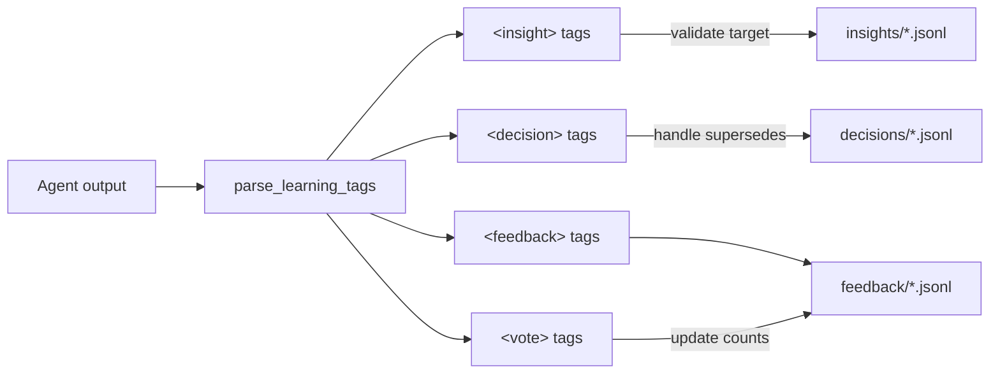
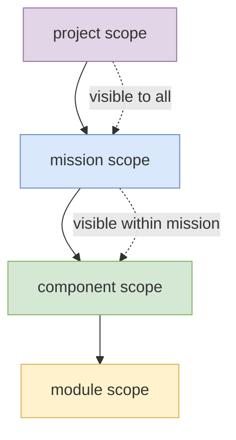
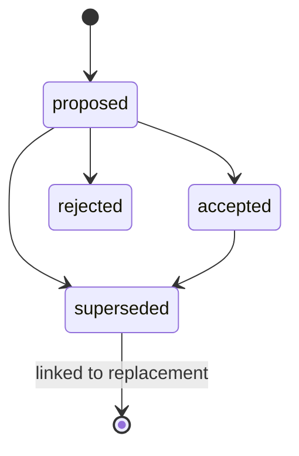

[← Back to Index](index.md)

# Learning System

The learning system captures knowledge generated by agents during orbit
execution. It stores feedback, insights, and decisions as JSONL records,
scoped hierarchically and assembled into prompts for future orbits.

**Source:** `lib/learning/`

## XML Tags

Agents communicate learning through XML tags embedded in their output:

```xml
<insight target="component:section-writer">
Cache section headings to avoid re-parsing the source document.
</insight>

<decision title="Use markdown tables" target="project" supersedes="dec-a1b2c3">
Standardise on markdown tables for all structured output.
</decision>

<feedback>
The prompt template should include the output directory path.
</feedback>

<vote id="fb-x1y2z3" weight="2">
Strongly agree with this feedback.
</vote>
```

### Tag Parsing

**Source:** `lib/learning/parse_tags.sh`



The `parse_learning_tags()` function processes agent output after each orbit:

1. Extract all `<insight>` tags → validate targets against registry → append
   to scoped insight JSONL
2. Extract all `<decision>` tags → handle supersedes → append to scoped
   decision JSONL
3. Extract all `<feedback>` tags → append to component feedback JSONL
4. Extract all `<vote>` tags → update vote counts on existing feedback entries

Unknown targets produce warnings but don't halt processing.

## Scope Hierarchy



Learning entries are scoped to control visibility and assembly:

| Scope | Format | File Path | Description |
|-------|--------|-----------|-------------|
| `project` | `project` | `learning/{type}/project.jsonl` | Visible to all components |
| `mission` | `mission:<name>` | `learning/{type}/mission.<name>.jsonl` | Visible within mission |
| `component` | `component:<name>` | `learning/{type}/component.<name>.jsonl` | Component-specific |
| `module` | `module:<name>` | `learning/{type}/module.<name>.jsonl` | Module-specific |
| `run` | `run` | `state/run-insights.tmp` | Current run only (temporary) |

Assembly collects entries hierarchically: project → mission → component,
deduplicates by content, and caps output.

## Feedback

**Source:** `lib/learning/feedback.sh`

Feedback captures general observations from agents about the system, prompts,
or workflow.

### Schema

```json
{
  "id": "fb-a1b2c3d4e5f6",
  "component": "section-writer",
  "content": "The prompt should include output directory path",
  "votes": 1,
  "created_at": "2026-03-10T14:30:00Z",
  "run_id": "run-x1y2z3"
}
```

### Voting

Agents can vote on existing feedback entries using `<vote>` tags:

```xml
<vote id="fb-a1b2c3" weight="2">Strongly agree</vote>
```

The weight is added to the entry's `votes` field. Higher-voted feedback is
surfaced first during assembly.

### Assembly

`feedback_assemble()` produces markdown sorted by votes (descending):

```markdown
## Feedback (top 10 by votes)
[3 votes] Cache section headings to avoid re-parsing
[2 votes] Include output directory path in prompt
[1 votes] Add error examples to the template
```

### CLI

```bash
orbit feedback <component>           # View feedback
orbit feedback clear <component>     # Remove all feedback
```

## Insights

**Source:** `lib/learning/insights.sh`

Insights capture reusable knowledge about patterns, techniques, or domain facts
that should inform future orbits.

### Schema

```json
{
  "id": "ins-a1b2c3d4e5f6",
  "scope_kind": "component",
  "scope_name": "section-writer",
  "content": "Markdown tables render better than HTML in output",
  "created_at": "2026-03-10T14:30:00Z",
  "run_id": "run-x1y2z3",
  "orbit": 5
}
```

### Assembly

`insight_assemble()` collects from all relevant scopes (project → mission →
component), deduplicates by content (keeps newest), sorts by creation time,
and caps at the limit (default 20):

```markdown
- [project] Use consistent heading levels across all output
- [component] Cache section headings to avoid re-parsing
```

### CLI

```bash
orbit insights <scope>               # View insights (e.g. "component:writer")
orbit insights clear <scope>         # Remove insights for scope
```

## Decisions

**Source:** `lib/learning/decisions.sh`

Decisions record explicit choices made during execution with a lifecycle for
review and supersession.

### Schema

```json
{
  "id": "dec-a1b2c3d4e5f6",
  "title": "Use markdown tables",
  "content": "Standardise on markdown tables for structured output",
  "target": "project",
  "scope_kind": "project",
  "scope_name": "",
  "status": "proposed",
  "supersedes": "",
  "created_at": "2026-03-10T14:30:00Z",
  "run_id": "run-x1y2z3",
  "orbit": 5
}
```

### Lifecycle



- **proposed** — initial state, agent has suggested this decision
- **accepted** — human or system has confirmed the decision
- **rejected** — decision was explicitly rejected
- **superseded** — replaced by a newer decision (linked via `supersedes` field)

### Assembly

`decision_assemble()` includes only active decisions (proposed or accepted),
sorted by creation time:

```markdown
- [proposed] Use markdown tables: Standardise on markdown tables
- [accepted] Single-file output: Write each section to its own file
```

### CLI

```bash
orbit decisions <target>                          # List decisions
orbit decisions accept <id-prefix>                # Accept
orbit decisions reject <id-prefix>                # Reject
orbit decisions supersede <id> <title> <content>  # Replace
```

## Storage

All learning data is stored as JSONL (JSON Lines) in `.orbit/learning/`:

```
.orbit/learning/
├── feedback/
│   └── section-writer.jsonl
├── insights/
│   ├── project.jsonl
│   ├── mission.transform.jsonl
│   └── component.section-writer.jsonl
└── decisions/
    ├── project.jsonl
    └── component.section-writer.jsonl
```

All writes use atomic append (write to temp file, then `mv`) to prevent
corruption from concurrent access or interruption.

[← Back to Index](index.md)
