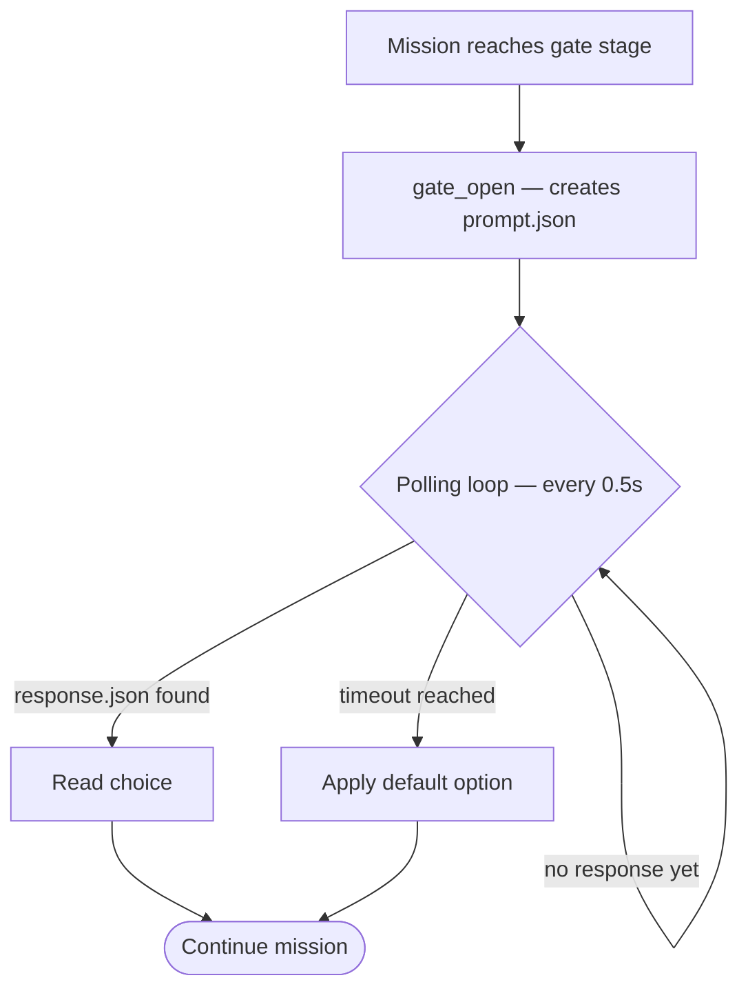
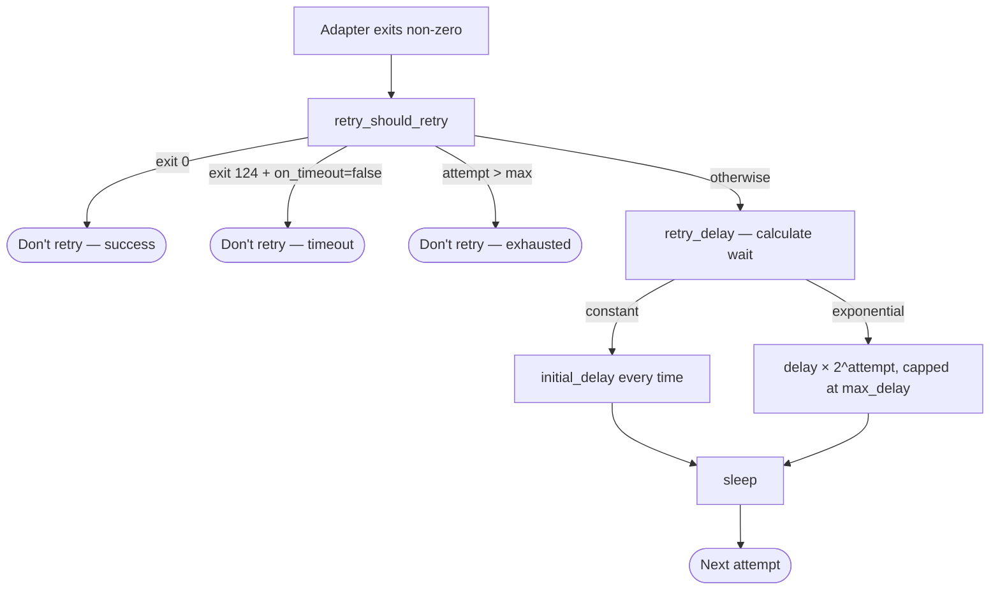

[← Back to Index](index.md)

# Mission Safety

Mission safety encompasses four mechanisms that protect mission execution:
flight rules, manual approval gates, waypoints for resume, and retry logic.

## Flight Rules

**Source:** `lib/flight_rules.sh`

Flight rules are mission-level guardrails that evaluate against runtime metrics
after each stage.

### Configuration

```yaml
flight_rules:
  - name: cost_limit
    condition: "metrics.cost_usd < 10.0"
    on_violation: abort
    message: "Cost exceeded $10 limit"

  - name: orbit_ceiling
    condition: "metrics.orbit_count < 100"
    on_violation: warn
    message: "Approaching orbit ceiling"

  - name: time_limit
    condition: "metrics.duration_seconds < 3600"
    on_violation: abort
    message: "Mission exceeded 1 hour"
```

### Available Metrics

| Placeholder | Description |
|-------------|-------------|
| `metrics.total_tokens` | Cumulative token usage |
| `metrics.cost_usd` | Cumulative cost in USD |
| `metrics.duration_seconds` | Elapsed time since mission start |
| `metrics.orbit_count` | Total orbits executed across all stages |

### Violation Actions

| Action | Behaviour |
|--------|-----------|
| `warn` | Log warning, continue execution |
| `abort` | Terminate mission immediately (exit code 2) |

### Evaluation

Conditions are expanded with current metric values and evaluated using AWK for
numeric comparison. Supported operators: `<`, `>`, `<=`, `>=`, `==`, `!=`.

Metrics are stored in `.orbit/runs/{run_id}/metrics.json` and updated after
each stage.

## Manual Approval Gates

**Source:** `lib/manual_gate.sh`

Gates pause mission execution for human approval at critical decision points.

### Configuration (in mission YAML)

```yaml
stages:
  - name: review-output
    gate:
      prompt: "Review the generated documentation. Approve to continue."
      options:
        - approve
        - reject
        - retry
      timeout: 72h
      default: approve
```

### Gate Lifecycle



### File Structure

```
.orbit/manual/{gate-id}/
├── prompt.json       # Gate definition and timeout
└── response.json     # Human response (when provided)
```

### prompt.json Schema

```json
{
  "gate_id": "review-output",
  "mission": "transform",
  "run_id": "run-a1b2c3",
  "prompt": "Review the generated documentation.",
  "options": ["approve", "reject", "retry"],
  "default": "approve",
  "timeout_at": "2026-03-13T14:30:00Z",
  "created_at": "2026-03-10T14:30:00Z"
}
```

### Timeout Behaviour

The timeout is calculated from **gate open time**, not mission start. The
`timeout_at` field stores the absolute deadline as ISO-8601. On each poll
iteration, current epoch is compared to `timeout_at` epoch. When timeout is
reached, the `default` option is applied automatically.

### CLI Commands

```bash
orbit pending                         # List gates awaiting response
orbit approve <gate-id>               # Approve (default option)
orbit approve <gate-id> --option retry  # Approve with specific option
orbit reject <gate-id>                # Reject
```

## Waypoints

**Source:** `lib/waypoints.sh`

Waypoints save stage completion markers to enable mission resumption after
failure or interruption.

### How It Works

After each stage completes successfully, a waypoint is saved:

```json
{
  "stage": "decompose",
  "mission": "transform",
  "status": "completed",
  "saved_at": "2026-03-10T14:30:00Z"
}
```

Stored at: `.orbit/runs/{run_id}/waypoints/{stage_name}.json`

### Resume

```bash
orbit launch my-mission --resume
```

Resume finds the most recent run for the mission, identifies the last completed
waypoint, and restarts execution from the **next** stage (the one after the
last waypoint, to avoid re-running completed work).

### Functions

| Function | Description |
|----------|-------------|
| `waypoint_save()` | Save completion marker for a stage |
| `waypoint_get_last()` | Get the most recently completed stage name |
| `waypoint_resume_from()` | Find the stage to resume FROM (after last waypoint) |
| `waypoint_list()` | Print all waypoints for a run |

## Retry Logic

**Source:** `lib/retry.sh`

Retry handles transient adapter failures with configurable backoff.

### Configuration

```yaml
retry:
  max_attempts: 3
  backoff: exponential
  initial_delay: 5s
  max_delay: 60s
  on_timeout: false
```

### Backoff Strategies

**Constant:** Always waits `initial_delay` between retries.

```
Attempt 1 fails → wait 5s → Attempt 2 fails → wait 5s → Attempt 3
```

**Exponential:** Doubles the delay each attempt, capped at `max_delay`.

```
Attempt 1 fails → wait 5s → Attempt 2 fails → wait 10s → Attempt 3 fails → wait 20s
```

### Timeout Handling

Exit code 124 indicates a timeout. By default, timeouts are **not** retried.
Set `on_timeout: true` to retry after timeouts.

### Duration Parsing

Retry delays support multiple formats:

| Format | Example | Interpretation |
|--------|---------|----------------|
| `Ns` | `5s` | 5 seconds |
| `Nms` | `500ms` | 1 second (rounded up) |
| `Nm` | `1m` | 60 seconds |
| `N` | `5` | 5 seconds (no unit) |

### Decision Flow



[← Back to Index](index.md)
