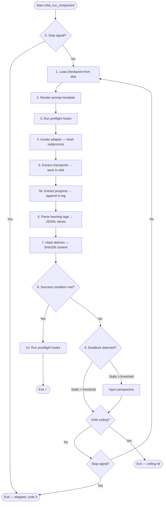

[← Back to Index](index.md)

# Orbit Loop

The orbit loop is the core execution engine of Rover. It invokes an agent
repeatedly until a success condition is met, managing checkpoints, deadlock
detection, and retry logic across orbits.

**Source:** `lib/orbit_loop.sh`

## Execution Flow

Each call to `orbit_run_component()` runs the following loop:



Steps in detail:

0. **Check stop signal** — if `stop.json` exists for the current run, exit
   immediately with code 3. Only applies in mission context (`--run-id` set).
1. **Load checkpoint** from component state directory
2. **Render prompt** via `render_template()` with variables:
   - `{orbit.n}` — current orbit number
   - `{orbit.max}` — orbit ceiling
   - `{orbit.checkpoint}` — previous checkpoint text
   - `{component.name}` — component name
   - Perspective prompt (if deadlock was detected)
2b. **Save rendered prompt** to `prompts/orbit-{n}.md` in the component state directory
3. **Run preflight hooks** — scripts listed in component config
4. **Invoke adapter** — spawns agent as fresh subprocess
5. **Extract checkpoint** from agent output and save to disk
5b. **Extract progress** from `<progress>` tags and append to progress log
6. **Parse learning tags** — route insights, decisions, feedback to stores
7. **Hash delivers** — SHA256 of deliverable file contents
8. **Check success condition** — evaluate file existence or bash expression
9. **Deadlock detection** — compare pre/post hashes
10. **Run postflight hooks**
11. **Repeat** or exit

## Checkpoints

Checkpoints provide continuity between orbits. Since each agent invocation is
stateless, the checkpoint is the only mechanism for passing context forward.

**Extraction rules:**
- If agent output contains `<checkpoint>...</checkpoint>`, use that content
  verbatim
- Otherwise, take the last 500 words of the raw output
- Cap at 500 words either way

**Storage:** `checkpoint.md` in the component state directory — overwritten each
orbit (only the latest checkpoint is kept). In mission context, this is
`.orbit/runs/{run-id}/state/{component}/checkpoint.md`; for standalone runs,
`.orbit/state/{component}/checkpoint.md`.

**Template injection:** The checkpoint is injected into the prompt template as
`{orbit.checkpoint}`, giving the agent its own previous notes.

## Progress Notes

Progress notes provide an append-only operational log across orbits within a
single run. Unlike checkpoints (which overwrite each orbit), progress
accumulates — orbit 10 can see what orbits 1-9 did, what failed, and what was
skipped.

**Extraction rules:**
- If agent output contains `<progress>...</progress>`, that content is appended
- No fallback — if the agent doesn't emit a `<progress>` tag, nothing is appended
- ~200 word soft limit per entry (prompt-level guidance, no engine trimming)

**Storage:** `progress.md` in the component state directory — append-only within
a run. Each entry is prefixed with an `## Orbit N` header. The file is cleared at
the start of each component run (fresh per run, not carried across runs). Path
follows the same run-scoping as checkpoint.

### Rendered Prompts

Every rendered prompt is saved to `prompts/orbit-{n}.md` in the component state
directory. This provides a complete audit trail of exactly what was sent to the
agent on each orbit invocation.

**Template injection:** The accumulated progress is injected into the prompt
template as `{orbit.progress}`, giving the agent the full operational history
from this run.

**Progress vs Checkpoint:**
- **Checkpoint** (`{orbit.checkpoint}`) — scratchpad for the next orbit. "Where
  to pick up." Overwritten each orbit.
- **Progress** (`{orbit.progress}`) — operational log. "What happened so far."
  Append-only across orbits.

## Success Conditions

Two modes for evaluating success:

### File Mode

```yaml
success:
  when: file
  condition: output/result.md
```

Succeeds when the specified file exists on disk.

### Bash Mode

```yaml
success:
  when: bash
  condition: >
    jq '[.tasks[] | select(.done == false)] | length == 0'
    {mission.run_dir}/plans/tasks.json
```

Succeeds when the bash expression exits with code 0.

## Deadlock Detection

Deadlock detection tracks whether the agent is making meaningful progress by
hashing the content of deliverable files.

**How it works:**
1. Before each orbit, hash all files listed in `delivers[]`
2. After the orbit, hash them again
3. If pre-hash equals post-hash, increment stall counter
4. If stall counter reaches `deadlock.threshold` (default 3), take action

**Important:** Hashing uses file *content*, not metadata (mtime, size). An
empty or absent `delivers` list disables deadlock detection for that component.

### Deadlock Actions

**`perspective`** (default) — Injects a reframing prompt at the top of the
next orbit's template. This encourages the agent to try a different strategy
rather than repeating the same approach. The stall counter resets after
perspective injection.

**`abort`** — Terminates the orbit loop immediately. The component exits with
a failure status.

## Stop Signal

When running inside a mission (`--run-id` is set), the orbit loop checks for a
stop signal file at `.orbit/runs/{run_id}/stop.json` at the top of each
iteration. If the file exists, the loop exits with code 3 without starting a new
orbit. The current orbit always completes before the check fires, ensuring the
agent is never interrupted mid-work.

See [Mission Safety — Graceful Stop](mission-safety.md#graceful-stop) for the
full lifecycle and CLI usage.

## Promise Flag

The orbit loop runs until the success condition is satisfied. The orbit ceiling
(`orbits.max`) is a safety stop, not the intended exit mechanism. A well-designed
component should always exit via its success condition — the ceiling is there
to prevent runaway execution.

## Retry on Adapter Failure

If the adapter returns a non-zero exit code, the retry system handles it:

- **Exit 0** — success, no retry
- **Exit 124** — timeout, retry only if `retry.on_timeout: true`
- **Other non-zero** — adapter failure, always eligible for retry
- **Past max_attempts** — give up

Delay between retries follows the configured backoff strategy (constant or
exponential). See [Mission Safety](mission-safety.md) for retry details.

## Template Variables

Variables available in prompt templates:

| Variable | Description |
|----------|-------------|
| `{orbit.n}` | Current orbit number (1-indexed) |
| `{orbit.max}` | Orbit ceiling |
| `{orbit.checkpoint}` | Previous orbit's checkpoint text |
| `{orbit.progress}` | Accumulated operational log from this run |
| `{component.name}` | Component name |

Variables are substituted using `{key}` syntax. Missing variables are left
as-is in the rendered output.

[← Back to Index](index.md)
