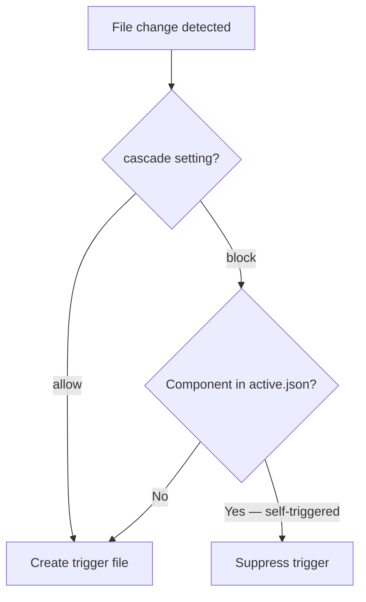
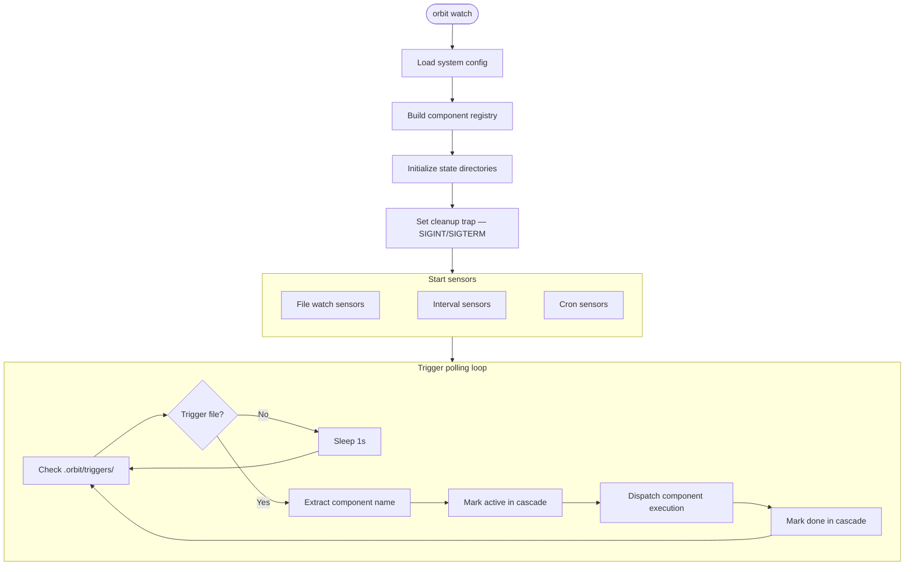

[← Back to Index](index.md)

# Sensors

Sensors detect external changes and trigger execution. Rover supports three
sensor types: file watch, interval schedule, and cron schedule.

Sensors can be defined on both **components** and **missions**. The schema is
identical at both levels. Mission sensors trigger an entire pipeline via
`orbit launch`; component sensors trigger a single component. See
[Sensors: Missions vs Components](configuration.md#sensors-missions-vs-components)
for guidance on which level to use.

**Source:** `lib/sensors/`

## File Watch Sensor

**Source:** `lib/sensors/file_watch.sh`

Monitors file system paths for changes and fires triggers after a debounce
quiet period.

### Configuration

```yaml
sensors:
  paths:
    - src/**/*.md
    - plans/tasks.json
  events:
    - modify
  debounce: 5s
  cascade: allow
```

### Implementation

Two modes, selected automatically:

**inotifywait mode** (Linux with inotify-tools installed):
- Watches directories matching glob patterns
- Uses two background processes: a reader and a debouncer
- Respects the cascade block flag

**Polling fallback** (macOS and systems without inotifywait):
- Polls every 1 second
- Computes a hash of all watched file contents
- Detects changes when hash differs from previous poll
- Applies debounce quiet period before triggering

### Trigger Mechanism

When a change is detected and debounce period passes, the sensor creates a
trigger file at `.orbit/triggers/{component}-filewatch`. The watch loop polls
this directory and dispatches the component.

### Cascade Control

When `cascade: block` is set, the file sensor checks
`.orbit/cascade/active.json` before firing. If the component itself is listed
as active (i.e., it produced the file change during its own execution), the
trigger is suppressed. This prevents infinite self-triggering loops.



## Interval Schedule Sensor

**Source:** `lib/sensors/schedule.sh`

Fires triggers at regular time intervals.

### Configuration

```yaml
sensors:
  schedule:
    every: 30m
```

### Duration Format

| Format | Example | Description |
|--------|---------|-------------|
| `Ns` | `45s` | N seconds |
| `Nm` | `30m` | N minutes |
| `Nh` | `24h` | N hours |
| `N` | `300` | N seconds (no unit) |

### Implementation

- Runs as a background loop process
- Calculates remaining time from last run on startup
- Sleeps for the interval duration, then creates trigger file
- Stores PID in `.orbit/sensors/{component}-interval.pid`

## Cron Schedule Sensor

**Source:** `lib/sensors/schedule.sh`

Delegates to the system crontab for time-based triggers.

### Configuration

```yaml
sensors:
  schedule:
    cron: "0 9 * * 1"    # Every Monday at 9am
```

### Cron Entry Format

```
0 9 * * 1 /path/to/project/orbit trigger my-component  # orbit-rover:my-component
```

The `# orbit-rover:{name}` tag on each entry is the identification mechanism
for management and cleanup. Rover never modifies crontab entries without this
tag.

### Management Commands

```bash
# List all Orbit cron entries
orbit cron list

# Remove all Orbit cron entries
orbit cron clear

# Preview planned entries from registry
orbit cron preview
```

### Registration

- Existing entries for the same component are replaced (deduplicated by tag)
- Installation uses atomic temp file write followed by `crontab` command
- On unregister, if no entries remain, the entire crontab is cleared

## Watch Mode

**Source:** `lib/watch.sh`

The `orbit watch` command starts the main sensor polling loop:



Steps in detail:

1. Load system config
2. Build component registry
3. Initialize state directories (triggers, sensors, cascade)
4. Set cleanup trap (SIGINT/SIGTERM)
5. Start file watch sensors for all active components with `sensors.paths`
6. Start file watch sensors for all active missions with `sensors.paths`
7. Start interval sensors for all active components/missions with `sensors.schedule.every`
8. Register cron sensors for all active components/missions with `sensors.schedule.cron`
9. Enter trigger polling loop:
   - Check `.orbit/triggers/` for new trigger files
   - Extract target name from filename
   - For component triggers: mark active in cascade tracker, dispatch component execution
   - For mission triggers: invoke `orbit launch` to run the full pipeline
   - Mark done in cascade tracker
   - Sleep 1 second between polls

### Cleanup

On exit (Ctrl+C or SIGTERM), watch mode:
- Stops all file watch background processes
- Stops all interval timer processes
- Unregisters all cron entries
- Removes sensor PID files

[← Back to Index](index.md)
