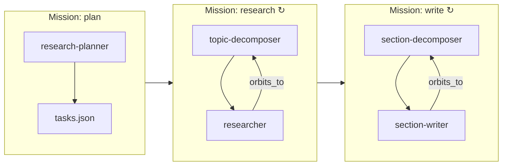
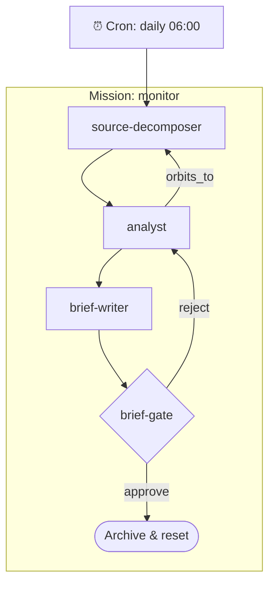
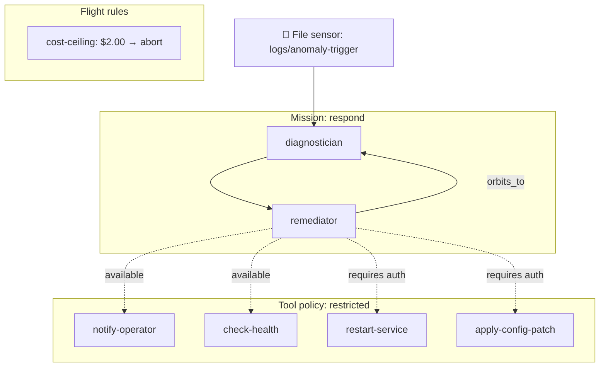

[← Back to Index](index.md)

# Studios

Studios are complete example projects that demonstrate Orbit Rover patterns.
Each studio is a self-contained project with its own `orbit.yaml`, components,
missions, prompts, and scripts.

**Location:** `studios/`

## orbit-research

**Pattern:** Three-mission workflow (plan → research → write)

A research intelligence studio that plans a research agenda, investigates topics,
and writes findings into a polished structured document. Merges the research and
document transformation patterns into a single end-to-end workflow.

### How It Works

1. **Plan mission:** `research-planner` reads the research brief and creates a
   topic-level task list in `.orbit/plans/research/tasks.json`
2. **Research mission:** `topic-decomposer` breaks each topic into atomic tasks,
   `researcher` investigates one per orbit with preflight source distillation
3. **Write mission:** `section-decomposer` reads completed findings and creates
   section tasks in `.orbit/plans/research/write-tasks.json`, `section-writer`
   writes one section per orbit

### Components

| Component | Purpose |
|-----------|---------|
| `research-planner` | Creates topic-level research plan |
| `topic-decomposer` | Breaks topics into atomic research tasks |
| `researcher` | Investigates one atomic task per orbit |
| `section-decomposer` | Breaks findings into section writing tasks |
| `section-writer` | Writes one section per orbit |

### Missions

| Mission | Pattern |
|---------|---------|
| `plan` | Sequential (plan) |
| `research` | Iterative (decompose → investigate, weekly cron) |
| `write` | Iterative (decompose → write, loops via `orbits_to`) |

### Specialist Subagents

When using the `claude-code` adapter, these subagents are available within an
orbit for delegation via the Agent tool:

| Agent | Purpose |
|-------|---------|
| `source-evaluator` | Scores source credibility, currency, depth, and relevance before committing an orbit to analysis |
| `synthesis-validator` | Cross-checks findings for contradictions, unsupported claims, and coverage gaps |

### Extras

- `orbit.yaml.local` — override file for local model/adapter settings
- `scripts/distil-sources.sh` — preflight source distillation
- `scripts/extract-findings.sh` — findings extraction helper
- `fixtures/` — example research brief, task lists, and findings

---

## orbit-sentinel

**Pattern:** Reactive (sensor-driven monitoring)

An intelligence monitoring studio that watches external sources for changes and
produces analysis.

### How It Works

1. **Cron sensor** triggers the monitor mission daily at 06:00
2. When triggered, `source-decomposer` breaks the watchlist into individual
   source monitoring tasks
3. `analyst` processes each source and produces intelligence findings
4. `brief-writer` synthesises all findings into `intelligence/daily-brief.md`

### Components

| Component | Purpose |
|-----------|---------|
| `source-decomposer` | Breaks watchlist into source tasks |
| `analyst` | Analyses individual sources |
| `brief-writer` | Synthesises findings into daily intelligence brief |

### Mission

| Mission | Pattern |
|---------|---------|
| `monitor` | Sequential (decompose → analyse → assemble) |

### Specialist Subagents

When using the `claude-code` adapter, these subagents are available within an
orbit for delegation via the Agent tool:

| Agent | Purpose |
|-------|---------|
| `signal-correlator` | Detects patterns across multiple sources and prior monitoring runs |
| `threat-enricher` | Adds CVSS scores, MITRE ATT&CK mappings, and exploit context to CVEs and security advisories |

### Key Design Choices

- Reactive: triggered by changes to watchlist, not on a schedule
- Scripts handle content fetching and distillation
- `watchlist.yaml` defines sources to monitor
- `fixtures/` — example watchlist, task list, findings, and daily brief

---

## orbit-fieldops

**Pattern:** Governed tools (autonomous operations with safety controls)

An autonomous operations studio for infrastructure incident response with
governed tool access.

### How It Works

1. **Diagnostician** analyses system health using `read-logs` and
   `check-health` tools
2. **Remediator** applies fixes using `apply-config-patch`,
   `restart-service`, and `notify-operator` tools
3. Tool access is restricted via policy — agents can only use assigned tools

### Components

| Component | Tools | Policy |
|-----------|-------|--------|
| `diagnostician` | read-logs, check-health | restricted |
| `remediator` | apply-config-patch, restart-service, notify-operator | restricted |

### Mission

| Mission | Pattern |
|---------|---------|
| `respond` | Sequential (diagnose → remediate) |

### Specialist Subagents

When using the `claude-code` adapter, these subagents are available within an
orbit for delegation via the Agent tool:

| Agent | Purpose |
|-------|---------|
| `log-analyst` | Deep log parsing — root cause isolation, cascade reconstruction, pattern classification |
| `remediation-sequencer` | Validates remediation task ordering for cascade safety and dependency correctness |
| `fix-auditor` | Verifies a fix resolved the original anomaly, not just that health checks pass |

### Key Design Choices

- All tool scripts validate auth keys before execution
- `tools/INDEX.md` documents available tools
- `RISK-REGISTRY.md` tracks operational risks
- `orbit.yaml.edge` — edge deployment override configuration
- `fixtures/` — example anomaly report, task list, and log file

---

## Studio CLAUDE.md Files

Each studio includes a `CLAUDE.md` file with in-session context for the
`claude-code` adapter. When Claude Code is invoked from a studio directory, it
automatically loads this file, giving the agent awareness of key file locations
and available specialist subagents.

Studio `CLAUDE.md` files should contain only information useful during an agent
session — not orbit mechanics (which belong in the component prompts).

## Specialist Subagents

Studios can include specialist subagent definitions in `.claude/agents/`. These
are narrow experts that the main agent can delegate to within a single orbit
via the Agent tool. Subagents are only available when using the `claude-code`
adapter.

Subagent definitions are Markdown files with YAML frontmatter specifying the
agent's name, description, available tools, and model. See the existing
definitions in `.claude/agents/` for examples.

## Creating Your Own Studio

> **Tip:** Use the [Config Specs](specs/) as AI context when authoring configs.
> Paste `docs/specs/component.md` into Claude, Cursor, or Copilot and describe
> what your component should do — the AI will produce valid YAML matching the
> actual schema.

1. Run `orbit init my-studio` to scaffold the project
2. Define components in `components/*.yaml` (see [component spec](specs/component.md))
3. Write prompt templates in `prompts/*.md` (see [prompt spec](specs/prompt.md))
4. Define missions in `missions/*.yaml` (see [mission spec](specs/mission.md))
5. Add lifecycle scripts in `scripts/`
6. Add tools in `tools/` (if needed)
7. Add a `CLAUDE.md` with key file paths and subagent references
8. Add specialist subagents in `.claude/agents/` if using `claude-code`
9. Test with `orbit run <component>` for individual components
10. Launch with `orbit launch <mission>` for full workflows

Study the existing studios for patterns that match your use case:

| If your task is... | Study |
|---------------------|-------|
| Research + writing | orbit-research |
| Monitoring / reactive | orbit-sentinel |
| Operations with tools | orbit-fieldops |

[← Back to Index](index.md)
