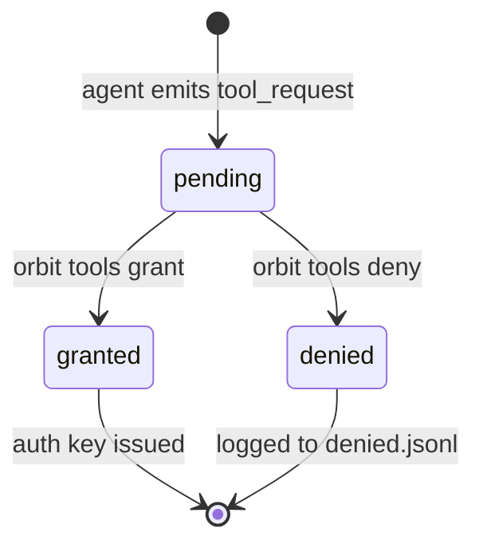
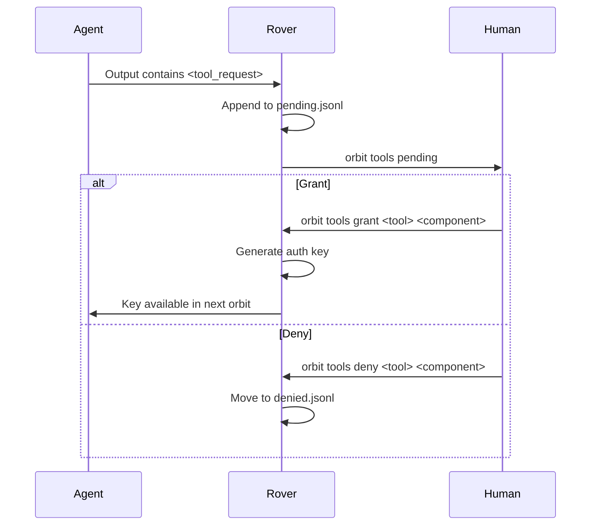

[← Back to Index](index.md)

# Tool System

The tool system governs which external tools agents can access during orbit
execution. It provides auth key generation, policy enforcement, and a request
governance workflow.

**Source:** `lib/tools/`

## Tool Policy

**Source:** `lib/tools/policy.sh`

Components declare their tool access policy:

```yaml
tools:
  policy: restricted        # standard | restricted
  assigned:
    - read-logs
    - check-health
    - restart-service
```

### Policy Modes

| Mode | Behaviour |
|------|-----------|
| `standard` | Agent has access to all default tools (no restrictions) |
| `restricted` | Agent can only use tools listed in `assigned` |

### Adapter Flags

Policy builds adapter-specific CLI flags:

| Adapter | Restricted Mode Flags |
|---------|-----------------------|
| claude-code | `--allowedTools tool1,tool2,...` |
| opencode | `--no-auto-tools --tools tool1,tool2,...` |

Standard policy produces no additional flags.

### Tool Validation

`tool_policy_validate()` checks that assigned tools exist in the project:

1. Checks `tools/INDEX.md` for tool listings
2. Checks for `tools/{name}` or `tools/{name}.sh` files
3. Warns (does not error) for each tool not found

## Auth Keys

**Source:** `lib/tools/auth.sh`

Auth keys provide a lightweight mechanism to verify that tool invocations
originate from authorised component/mission/run combinations.

### Key Generation

```bash
tool_auth_generate "my-component" "my-mission" "run-abc123"
# → deterministic 12-char hash
```

Keys are deterministic: the same component/mission/run always produces the same
key. This allows validation without storing secrets.

### Granting Tools

```bash
tool_auth_grant "my-component" "read-logs" "$auth_key" "$state_dir"
```

Creates or updates `.orbit/tool-auth/{component}.json`:

```json
{
  "component": "my-component",
  "granted_tools": ["read-logs", "check-health"],
  "auth_key": "a1b2c3d4e5f6",
  "granted_at": "2026-03-10T14:30:00Z"
}
```

### Key Validation

```bash
tool_auth_check "my-component" "$key" "$state_dir"
# Returns 0 if valid, 1 if invalid
```

Tools can call `_auth-check.sh` to validate incoming auth keys before executing
privileged operations.

### Querying Grants

```bash
tool_auth_get_granted "my-component" "$state_dir"
# Outputs one tool per line
```

## Tool Requests

**Source:** `lib/tools/requests.sh`

When an agent needs a tool it doesn't have access to, it can submit a request
via XML tags:

```xml
<tool_request>
<tool>restart-service</tool>
<justification>Service is unresponsive after config change</justification>
</tool_request>
```

### Request Lifecycle



### Schema

```json
{
  "id": "req-a1b2c3d4e5f6",
  "component": "remediator",
  "tool": "restart-service",
  "justification": "Service is unresponsive after config change",
  "run_id": "run-x1y2z3",
  "status": "pending",
  "created_at": "2026-03-10T14:30:00Z"
}
```

### Governance Workflow



1. Agent output is scanned for `<tool_request>` tags
2. Requests are appended to `.orbit/tool-requests/pending.jsonl`
3. Human reviews via `orbit tools pending`
4. Grant or deny:

```bash
# Grant access (optionally with auth key)
orbit tools grant restart-service remediator

# Deny with reason
orbit tools deny restart-service remediator
```

5. Denied requests are moved to `.orbit/tool-requests/denied.jsonl`

### CLI

```bash
orbit tools pending    # List pending requests
orbit tools grant      # Approve a request
orbit tools deny       # Reject a request
orbit tools log        # Show all request history
```

## Tool Scripts

Tool implementations live in the project's `tools/` directory. The
`tools/INDEX.md` file serves as a registry of available tools with
descriptions.

Example from orbit-fieldops:

```
tools/
├── INDEX.md               # Tool descriptions and usage
├── _auth-check.sh         # Auth key validation helper
├── apply-config-patch.sh  # Apply configuration changes
├── check-health.sh        # Service health check
├── notify-operator.sh     # Send operator notifications
├── read-logs.sh           # Read service logs
└── restart-service.sh     # Restart a service
```

Each tool script should validate its auth key before executing:

```bash
#!/usr/bin/env bash
source "$(dirname "$0")/_auth-check.sh"
auth_check "$1" || exit 1
# ... tool logic
```

[← Back to Index](index.md)
